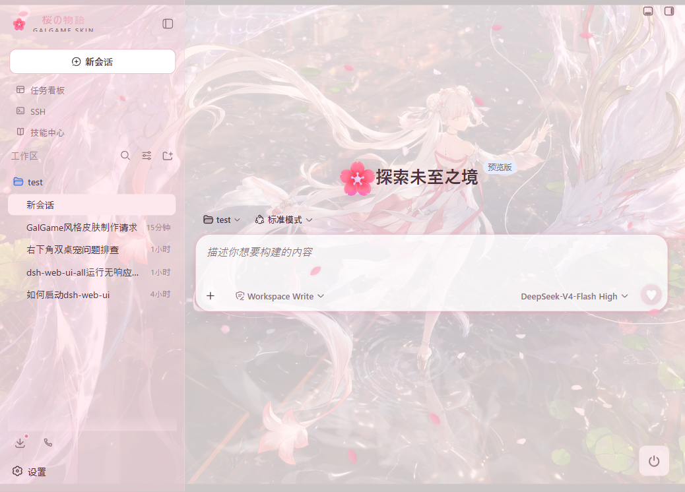
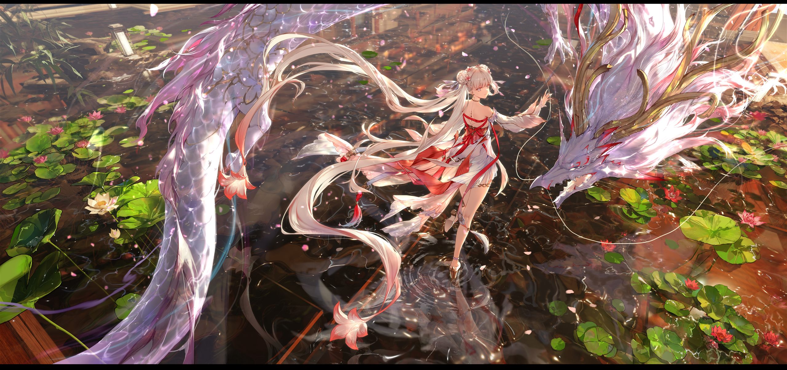

# dsh-galgame-ui

DSH Web 的 Galgame 风格动态增强插件，配套 `galgame-sakura` 静态皮肤。

## 运行环境

- DSH Web
- Skin Center：`@linxin666/dsh-client-ui-skin-center`
- `dsh-galgame-ui` 动态插件，用于加载花瓣、品牌标题、回合尾饰和设置面板

`@linxin666/dsh-web-ui-all` 已包含 Skin Center；不使用全家桶时，单独安装 `@linxin666/dsh-client-ui-skin-center` 即可。

## 预览

### DSH Web 集成



### 皮肤背景



## 安装

`@linxin666/dsh-web-ui-all` 已包含 Skin Center；不使用全家桶时，先执行：

```cmd
dsh plugin --profile web add @linxin666/dsh-client-ui-skin-center
```

执行：

```powershell
git clone https://github.com/galact-byte/dsh-galgame-ui.git
Set-Location .\dsh-galgame-ui

dsh plugin --profile web add "link:$PWD"
powershell -ExecutionPolicy Bypass -File .\scripts\install-skin.ps1
```

重启 DSH Web 后刷新 `http://127.0.0.1:3080/`。


## 注意事项

- DSH Skin Center 不会执行用户皮肤目录中的 `hooks.mjs`，动态 DOM/React 效果由 `dsh-galgame-ui` 插件负责。
- `hooks.mjs` 保留在皮肤目录中作为实验/备查文件，但当前 `skin.json` 不引用它。
